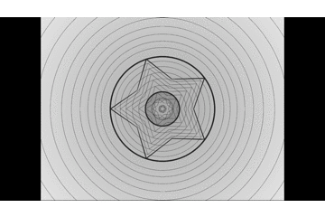
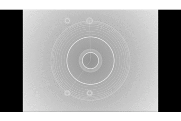

# Project 2
### I used ofGetElapsedTimef() and trigonometric function(sin(),cos()& tan()) to create some visual change over time. I makd background gradient, size of shapes(circle, line, dot and star), color of shapes change with time.
####

